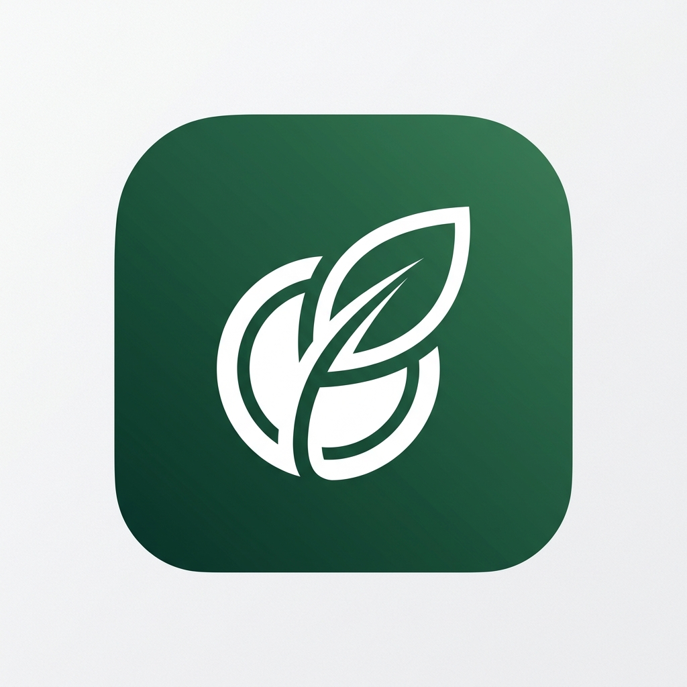

# 🍃 Forest Finance (森林風記帳 App)

這是一款專為熱愛簡約與大自然風格的用戶設計的記帳 App。我們將「理財」與「森林養成」結合，讓記帳不再只是枯燥的數字紀錄，而是一場療癒的森林培育之旅。

## ✨ 特色亮點

### 🌳 遊戲化養成：我的森林
- **連續記帳成長**：你的記帳天數（Streak）決定了森林中樹木的樣貌。
- **成長階段**：從一株**希望幼苗 (🌱)** 到 **成長小樹 (🌿)**，最終長成 **茂盛大樹 (🌳)**。
- **沉浸式設計**：專屬的森林介面，伴隨著緩慢飄動的雲朵與微風動畫。

### ⚡ 森林速記 (Quick Add)
- **自然語言解析**：輸入「午餐 120」即可自動分類並儲存，省去繁瑣點選。
- **預算即時追蹤**：輸入時即時顯示當月預算餘額，幫助你做出理財決策。
- **極速存檔**：搭配 Enter 鍵與療癒的「樹葉噴發」特效，秒速完成紀錄。

### 📊 專業帳務分析
- **日曆視圖**：直觀的日曆介面，隨時點選日期查看當日明細。
- **圖表統計**：內建 Chart.js 圓餅圖，清晰分析支出比例，掌握錢包動向。
- **資產總覽**：彙整歷史收入、支出與餘額，一目了然。

### 🌍 國際化與個性化
- **多語系支持**：內建繁體中文、簡體中文與英文。
- **多幣別切換**：支援 TWD, USD, JPY, CNY, EUR 等多國貨幣格式化。
- **自訂預算**：隨時調整每月的預算上限，適應不同的消費習慣。

## 🛠 技術架構
- **核心框架**：Vanilla JavaScript / HTML5 / CSS3
- **快速紀錄與養成**：React 18 (Standalone Babel)
- **圖標系統**：Lucide Icons
- **數據可視化**：Chart.js
- **資料儲存**：Local Storage (完全隱私，資料儲存於您的瀏覽器中)

## 🚀 快速開始
1. 將本專案下載至電腦。
2. 點擊 `login.html` 進入系統。
3. 輸入您的專屬 User ID（系統會以此 ID 隔離儲存不同用戶的資料）。
4. 開始種植您的理財森林！

## 🎨 設計美學
我們採用了豐富的綠色色調與圓潤的 UI 組件，搭配微交互動畫（如按鈕點擊縮放、噴發粒子、雲朵飄動），致力於打造市面上最 premium、最有溫度的網頁版記帳 App。

---
*「一筆紀錄，一棵大樹。讓你的資產與森林一同茁壯。」*
